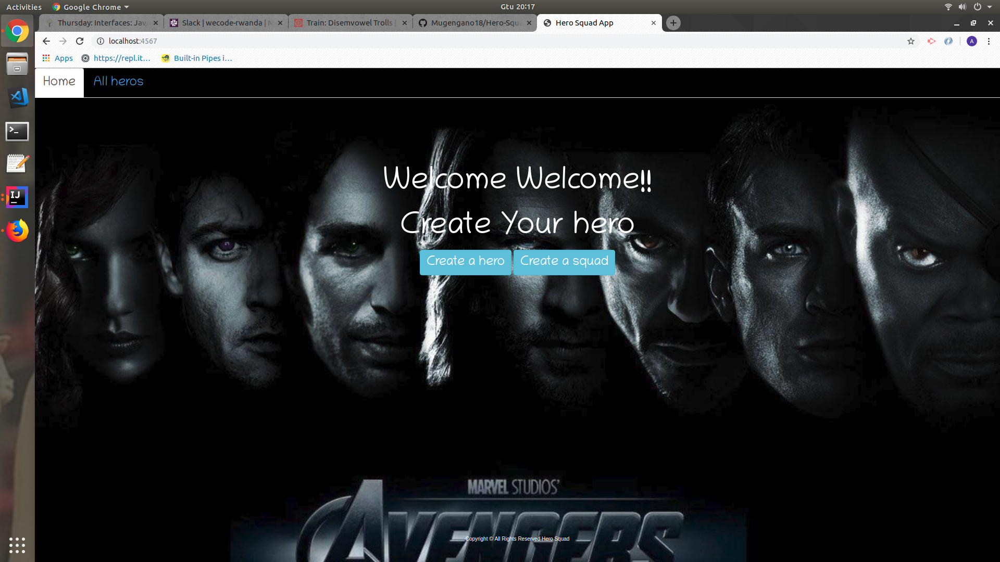

# Hero-Squad-App
this is a hero-squad app tha show a hero league,and also shows all the heroes one has created and also is able to create any squad he/she wants
and this app help the children to be creative and be able to increase there imagination.

## here is my project entry

## Behavior driven development
- The project was asking us to make an App where the user will be able to create a hero and a squad and be able to choose any squad he/she wants to joins 
- We were asked to create classes of hero and squad and inside them create constructors and include in all the properties of each method
- We should also create relevant tests to all the classes
- We were asked to use branching
- We should also include a gitignore file
- And finally deploy it  to heroku

## Contacts
- Email:mugengano@gmail.com
- Tel nbr:0787831940

## Author
- Mugengano Alice

## Techonologies used in the project

- java language
- Spark framework
- Handlebars

## Copyrights && Permissions

- Copyrights &copy; ALL RIGHTS RESERVED Hero-squad-app